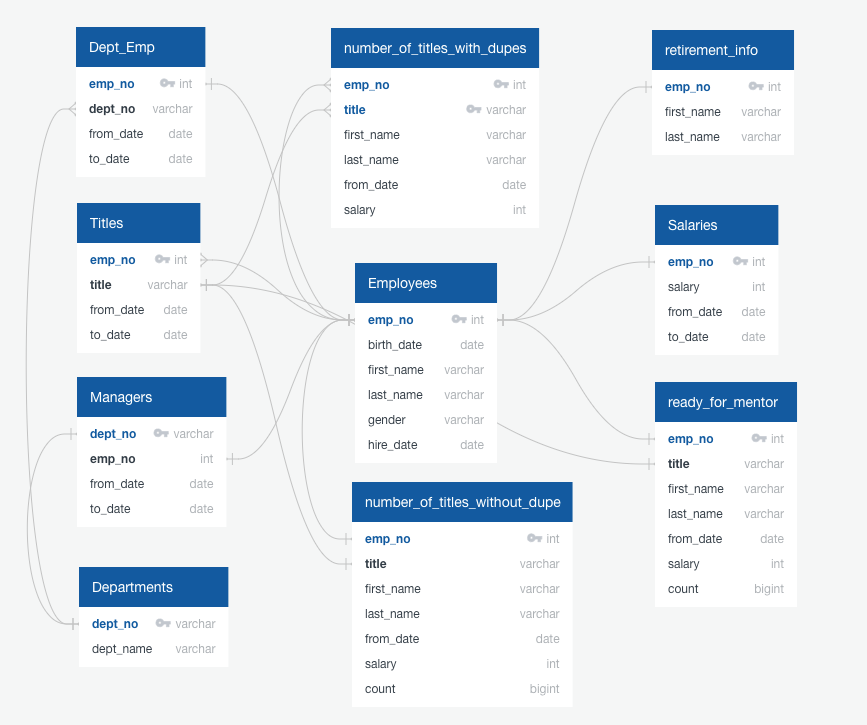
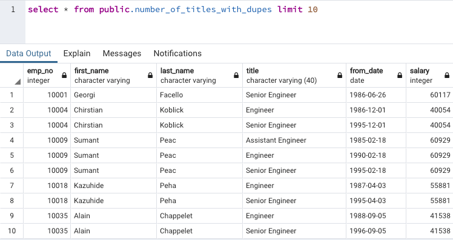

# Pewlett-Hackard-Analysis
    A case study in database modeling and SQL using PostgreSQL relational database engine. 

## Project Summary
The company Pewlett Hackard has a number of employees approching retirement age. This analysis use basic to intermidiate SQL queries to identify these employees as well as employees ready to mentor others. The entitry relationship diagram below shows the end state of the database required to complete the challenge. The queries and sample output section shows how we approched the challenge and the result of the queries. 

## Entity Relationship Diagram

## Challenge Queries and Sample Output
### Number of [titles] Retiring
This query uses inner joins to the employees, titles and salary tables to extract the required data point. The employees table  has a one to many relationship with the title table which creates duplicates in this dataset.
#### Query
select ri.emp_no, ri.first_name, ri.last_name, t.title, t.from_date, s.salary
into number_of_titles_with_dupes
from retirement_info ri
    inner join titles t
    on ri.emp_no = t.emp_no
    inner join salaries s
    on ri.emp_no = s.emp_no
#### Output

