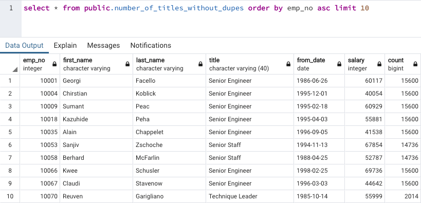
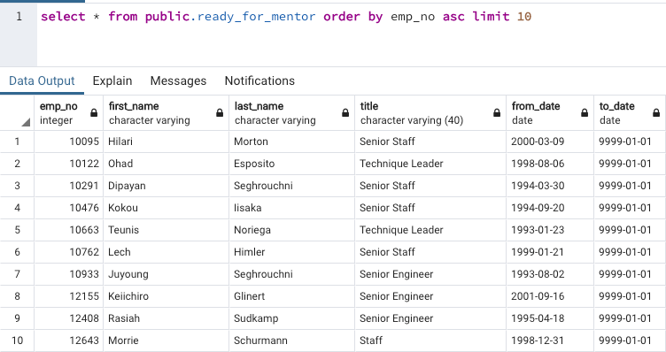

# Pewlett-Hackard-Analysis
    A case study in database modeling and SQL using PostgreSQL relational database engine. 

## Project Summary
The company Pewlett Hackard has several employees approaching retirement age. This analysis uses basic to intermediate SQL queries to identify these employees as well as employees ready to mentor others. The entity relationship diagram below show the end state of the database required to complete the challenge. The queries and sample output section shows how we approached the challenge and the result of the queries. 

## Entity Relationship Diagram

## Challenge Queries and Sample Output
### Number of [titles] Retiring
This query uses inner joins to the employees, titles and salary tables to extract the required data point. The employees table has a one to many relationship with the title table which creates duplicates in the dataset.
#### Query
select ri.emp_no, ri.first_name, ri.last_name, t.title, t.from_date, s.salary
into number_of_titles_with_dupes
from retirement_info ri
    inner join titles t
    on ri.emp_no = t.emp_no
    inner join salaries s
    on ri.emp_no = s.emp_no
#### Output

### Only the Most Recent Titles
In this query we remove the duplicates from the dataset above using a partion statement. We used a CTE to facilitate the frequency count of employee titles. We made an assumption that the count should only include current title and not titles previously held by the same employee. 

#### Query
with UN as (SELECT emp_no, first_name, last_name, title, from_date, salary, 
     ROW_NUMBER() OVER 
		(PARTITION BY (first_name, last_name) ORDER BY from_date DESC) rn
   FROM public.number_of_titles_with_dupes		  
            ) 

SELECT un.emp_no, un.first_name, un.last_name, un.title, un.from_date, un.salary, tcount.count
into number_of_titles_without_dupes 
FROM UN
-- join the count of employees with the same title on title 
  inner join (Select un.title, count(un.title) as count from UN group by un.title) tcount
  on UN.title = tcount.title
WHERE 
  rn = 1
  
 ORDER BY from_date DESC;

#### Output

### Who’s Ready for a Mentor?
The company is looking to identify employees ready to share work experience through mentorships. The query below identifies current employees born in 1965. We use a subquery instead of a CTE to eliminate duplicates since we did not need to reuse the dataset as in the above query. 

#### Query
select tm.emp_no, tm.first_name, tm.last_name, tm.title, tm.from_date , tm.to_date
into ready_for_mentor
from (
	SELECT e.emp_no, e.first_name, e.last_name, t.title, t.from_date , t.to_date,
		ROW_NUMBER() OVER 
			(PARTITION BY (first_name, last_name) ORDER BY t.from_date DESC) rn
	FROM employees e
	inner join titles t
		on e.emp_no = t.emp_no
	inner join dept_emp de
		on e.emp_no = de.emp_no
	WHERE e.birth_date BETWEEN '1965-01-01' AND '1965-12-31'
	and de.to_date = '9999-01-01'
	) tm
where tm.rn = 1
order by tm.last_name

#### Output

